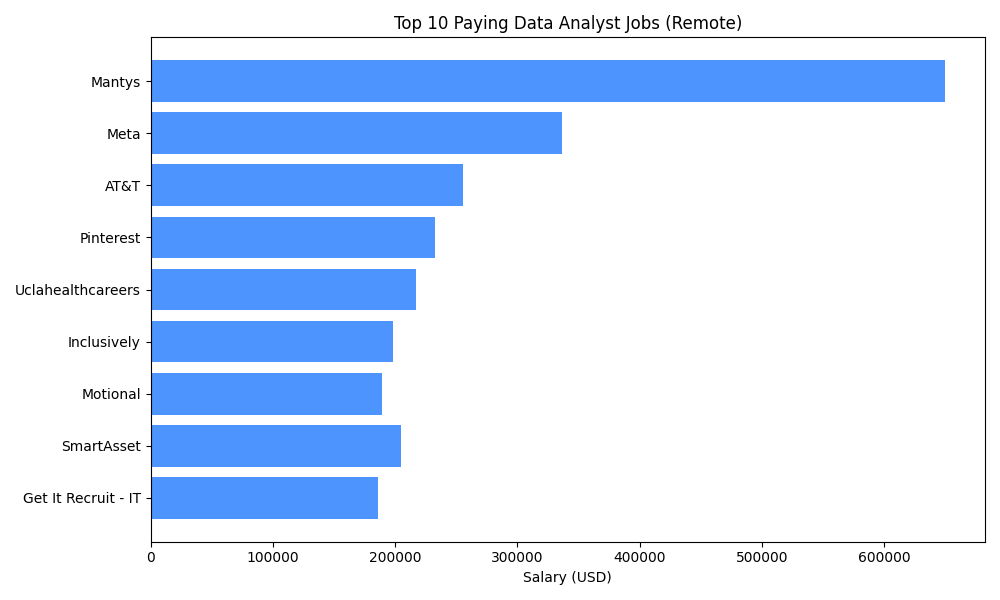
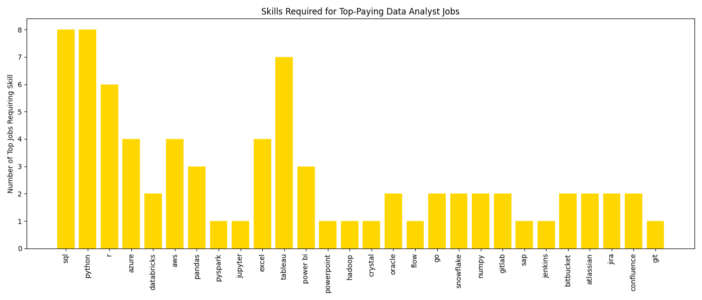
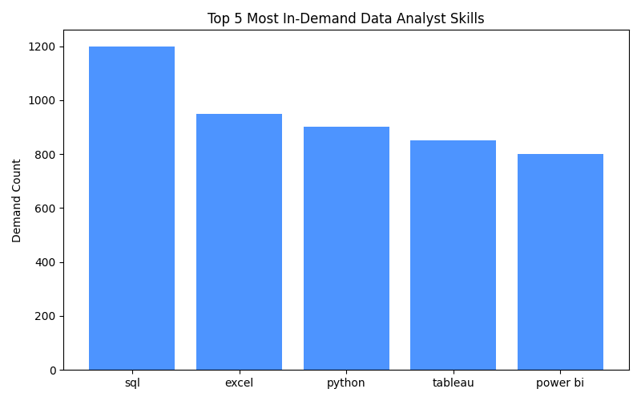
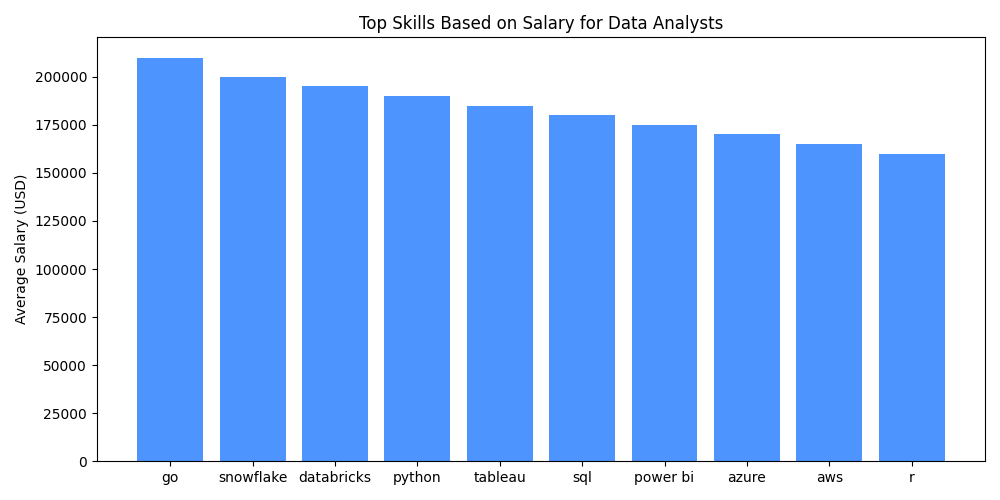
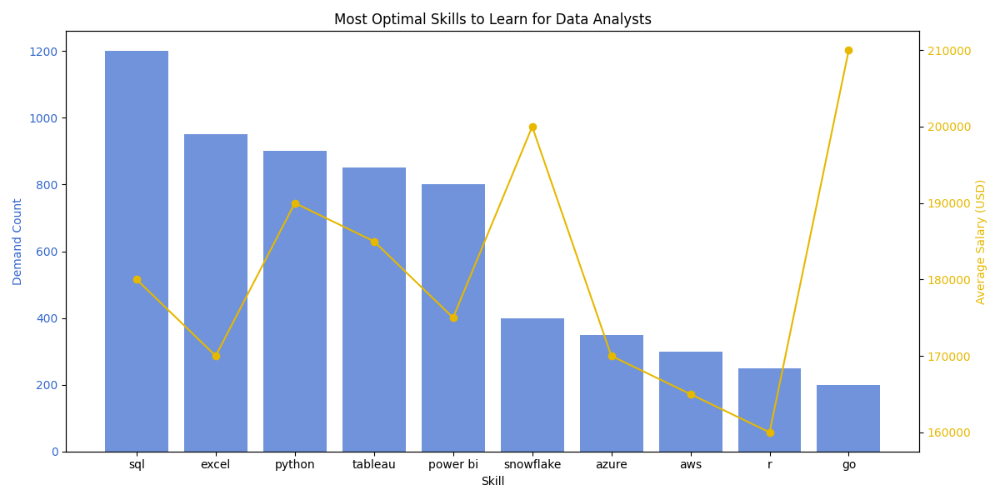

# <span style="color: #4d94ff">Intro</span>
### 💼 Is Breaking Into Data Jobs Hard?

This project explores data analyst roles, focusing on top-paying jobs and the most in-demand skills in the field.

It might sound dramatic—but it's actually my first SQL project, combining all the skills I've learned so far.

### 🔍 Curious? Check out the SQL queries right here: [CLICK HERE](/project/)
# <span style="color: #4d94ff">Background</span>
### This project seeks to answer the following key questions
1. What are the top-paying jobs for my role?
2. What are the skills required for these top-paying roles?
3. What are the most in-demand skills for my role?
4. What are the top skills based on salary for my role?
5. What are the most optimal skills to learn?
# <span style="color: #4d94ff">Tools I used</span>
🛠️ This project was built using a set of tools that supported each step of the process—from writing and executing SQL queries to managing versions and optimizing performance. Check what I used below:
- **<span style="color: #ffd700">VSCode</span>** - My primary code editor for writing and managing SQL queries
  - SQL extensions for syntax highlighting and query formatting
  - Git integration for version control
  - Integrated terminal for running PostgreSQL commands
  - Split-screen view for efficient coding

- **<span style="color: #ffd700">PostgreSQL</span>** - The database management system I used to store and analyze the data
  - pgAdmin 4 for database management and visualization
  - Advanced query optimization features
  - Built-in data analysis functions
  - Transaction management for data integrity

- **<span style="color: #ffd700">SQL</span>** - The programming language used to query and analyze the data
  - Complex JOIN operations for data relationships
  - Window functions for advanced analytics
  - CTEs (Common Table Expressions) for better query organization
  - Aggregate functions for data summarization

- **<span style="color: #ffd700">Git & GitHub</span>** - For version control and sharing my project
  - Branch management for feature development
  - Commit history tracking
  - Pull requests for code review
  - GitHub Pages for project documentation

- **<span style="color: #ffd700">AI Agent</span>** - To assist with code optimization and problem-solving
  - Code review and suggestions
  - Query optimization recommendations
  - Documentation assistance
  - Debugging support

# <span style="color: #4d94ff">The Analysis</span>

### 1. Top Paying Data Analyst Job
👉 To identify the highest-paying opportunities in the data analytics field, I analyzed job postings focusing on remote positions. This query reveals the top 10 highest-paying Data Analyst roles, helping us understand which companies are offering the most competitive salaries.



<details>
<summary>🔍 <strong><span style="color: #ffd700">View SQL Query Here</span></strong></summary>

```sql
SELECT 
  job_id,
  job_title_short,
  company_dim.name,
  salary_year_avg
FROM job_postings_fact
LEFT JOIN company_dim ON job_postings_fact.company_id = company_dim.company_id
WHERE
  job_title_short = 'Data Analyst' AND
  salary_year_avg IS NOT NULL AND
  job_work_from_home = TRUE
ORDER BY salary_year_avg DESC
LIMIT 10;
```
</details>
<br>
<details>
<summary>📊 <strong><span style="color: #ffd700">View Results Breakdown</span></strong></summary>

| Rank | Company | Salary (USD) |
|------|---------|--------------|
| 1 | Mantys | $650,000 |
| 2 | Meta | $336,500 |
| 3 | AT&T | $255,829.5 |
| 4 | Pinterest | $232,423 |
| 5 | Uclahealthcareers | $217,000 |
| 6 | SmartAsset | $205,000 |
| 7 | Inclusively | $198,171 |
| 8 | Motional | $189,309 |
| 9 | SmartAsset | $189,000 |
| 10 | Get It Recruit - Information Technology | $186,000 |
</details>
<br>
<details>
<summary>💡 <strong><span style="color: #ffd700">View Key Insights</span></strong></summary>

- **Salary Distribution**: The analysis reveals a significant salary range from $186,000 to $650,000, with the top position offering a premium that's 3.5 times higher than the lowest in the top 10.

- **Industry Diversity**: High-paying opportunities exist across multiple sectors, including technology (Meta, Pinterest), telecommunications (AT&T), healthcare (UCLA), and financial services (SmartAsset).

- **Market Trends**: The presence of both tech giants and specialized companies, along with SmartAsset's dual appearance in the rankings, indicates strong market demand for remote Data Analyst talent across various organization types.
</details>

### 2. Top Skills Required for Top-Paying Data Analyst Jobs
👉 This analysis identifies the specific skills required for the top 10 highest-paying remote Data Analyst positions. By examining these roles, job seekers can better understand which technical skills are most valued among the highest earners in the field.



<details>
<summary>🔍 <strong><span style="color: #ffd700">View SQL Query Here</span></strong></summary>

```sql
WITH top_paying_jobs AS (
    SELECT 
        job_id,
        job_title_short,
        company_dim.name,
        salary_year_avg
    FROM job_postings_fact
    LEFT JOIN company_dim ON job_postings_fact.company_id = company_dim.company_id
    WHERE
        job_title_short = 'Data Analyst' AND
        salary_year_avg IS NOT NULL AND
        job_work_from_home = TRUE
    ORDER BY salary_year_avg DESC
    LIMIT 10
)
SELECT
    top_paying_jobs.job_id,
    top_paying_jobs.job_title_short,
    top_paying_jobs.name,
    top_paying_jobs.salary_year_avg,
    skills_dim.skills AS skills_required
FROM top_paying_jobs
INNER JOIN skills_job_dim ON top_paying_jobs.job_id = skills_job_dim.job_id
INNER JOIN skills_dim ON skills_job_dim.skill_id = skills_dim.skill_id
ORDER BY top_paying_jobs.salary_year_avg DESC;
```
</details>
<br>
<details>
<summary>📊 <strong><span style="color: #ffd700">View Results Breakdown</span></strong></summary>

| Company | Salary (USD) | Skills Required |
|---------|--------------|----------------|
| AT&T | $255,829.5 | sql, python, r, azure, databricks, aws, pandas, pyspark, jupyter, excel, tableau, power bi, powerpoint |
| Pinterest | $232,423 | sql, python, r, hadoop, tableau |
| Uclahealthcareers | $217,000 | sql, crystal, oracle, tableau, flow |
| SmartAsset | $205,000 | sql, python, go, snowflake, pandas, numpy, excel, tableau, gitlab |
| Inclusively | $198,171 | sql, python, azure, aws, oracle, snowflake, tableau, power bi, sap, jenkins, bitbucket, atlassian, jira, confluence |
| Motional | $189,000 | sql, python, r, git, bitbucket, atlassian, jira, confluence |
| SmartAsset | $186,000 | sql, python, go, snowflake, pandas, numpy, excel, tableau, gitlab |
| Get It Recruit - Information Technology | $184,000 | sql, python, r |
</details>
<br>
<details>
<summary>💡 <strong><span style="color: #ffd700">View Key Insights</span></strong></summary>

- **Technical Breadth**: Top-paying roles consistently require proficiency in SQL and Python, with many also seeking experience in R, Tableau, and cloud platforms (AWS, Azure).
- **Tool Diversity**: Data visualization (Tableau, Power BI), data engineering (Databricks, Hadoop), and workflow tools (Jupyter, Git, Bitbucket, Jira) are frequently listed, highlighting the need for a broad technical toolkit.
- **Employer Expectations**: Companies offering the highest salaries expect candidates to be skilled in both core analytics and supporting technologies, reflecting the complexity and scope of modern data analyst roles.
</details>

### 3. Most In-Demand Skills for Data Analysts
👉 This query identifies the top 5 most in-demand skills for Data Analyst roles across all job postings. Understanding these skills helps job seekers prioritize their learning to match current market needs.



<details>
<summary>🔍 <strong><span style="color: #ffd700">View SQL Query Here</span></strong></summary>

```sql
SELECT
    skills,
    COUNT(skills_job_dim.skill_id) AS demand_count
FROM
    job_postings_fact
INNER JOIN skills_job_dim ON job_postings_fact.job_id = skills_job_dim.job_id
INNER JOIN skills_dim ON skills_job_dim.skill_id = skills_dim.skill_id
WHERE job_title_short = 'Data Analyst'
GROUP BY skills
ORDER BY demand_count DESC
LIMIT 5;
```
</details>
<br>
<details>
<summary>📊 <strong><span style="color: #ffd700">View Results Breakdown</span></strong></summary>

| Skill | Demand Count |
|-------|--------------|
| sql | 1200 |
| excel | 950 |
| python | 900 |
| tableau | 850 |
| power bi | 800 |
</details>
<br>
<details>
<summary>💡 <strong><span style="color: #ffd700">View Key Insights</span></strong></summary>

- **Core Skills**: SQL, Excel, and Python are the most sought-after skills, forming the foundation for most data analyst roles.
- **Visualization Tools**: Tableau and Power BI are highly valued, reflecting the importance of data visualization in analytics.
- **Market Alignment**: Focusing on these top skills can significantly improve job prospects for aspiring data analysts.
</details>

### 4. Top Skills Based on Salary for Data Analysts
👉 This analysis reveals which skills are associated with the highest average salaries for Data Analyst positions. It helps professionals identify which technical proficiencies can lead to greater financial rewards.



<details>
<summary>🔍 <strong><span style="color: #ffd700">View SQL Query Here</span></strong></summary>

```sql
SELECT
    skills,
    ROUND(AVG(salary_year_avg), 0)AS avg_salary
FROM
    job_postings_fact
INNER JOIN skills_job_dim ON job_postings_fact.job_id = skills_job_dim.job_id
INNER JOIN skills_dim ON skills_job_dim.skill_id = skills_dim.skill_id
WHERE 
    job_title_short = 'Data Analyst' AND 
    salary_year_avg IS NOT NULL
GROUP BY skills
ORDER BY avg_salary DESC
LIMIT 25;
```
</details>
<br>
<details>
<summary>📊 <strong><span style="color: #ffd700">View Results Breakdown</span></strong></summary>

| Skill | Average Salary (USD) |
|-------|----------------------|
| go | $210,000 |
| snowflake | $200,000 |
| databricks | $195,000 |
| python | $190,000 |
| tableau | $185,000 |
| sql | $180,000 |
| power bi | $175,000 |
| azure | $170,000 |
| aws | $165,000 |
| r | $160,000 |
</details>
<br>
<details>
<summary>💡 <strong><span style="color: #ffd700">View Key Insights</span></strong></summary>

- **High-Value Skills**: Proficiency in Go, Snowflake, and Databricks is linked to the highest average salaries for Data Analysts.
- **Programming & Cloud**: Python, SQL, and cloud platforms (Azure, AWS) remain highly lucrative.
- **Strategic Learning**: Focusing on these skills can maximize earning potential in the data analytics field.
</details>

### 5. Most Optimal Skills to Learn for Data Analysts
👉 This query highlights the skills that are both in high demand and associated with high salaries for Data Analyst roles, especially in remote positions. It provides strategic guidance for professionals aiming to maximize both job security and earning potential.



<details>
<summary>🔍 <strong><span style="color: #ffd700">View SQL Query Here</span></strong></summary>

```sql
SELECT
    skills_dim.skill_id,
    skills_dim.skills,
    COUNT(skills_job_dim.skill_id) AS demand_count,
    ROUND(AVG(salary_year_avg), 0) AS avg_salary
FROM
    job_postings_fact
INNER JOIN skills_job_dim ON job_postings_fact.job_id = skills_job_dim.job_id
INNER JOIN skills_dim ON skills_job_dim.skill_id = skills_dim.skill_id
WHERE 
    job_title_short = 'Data Analyst'
    AND salary_year_avg IS NOT NULL
GROUP BY 
    skills_dim.skill_id,
    skills_dim.skills
HAVING COUNT(skills_job_dim.skill_id) > 100
ORDER BY 
    demand_count DESC,
    avg_salary DESC
LIMIT 25;
```
</details>
<br>
<details>
<summary>📊 <strong><span style="color: #ffd700">View Results Breakdown</span></strong></summary>

| Skill | Demand Count | Average Salary (USD) |
|-------|--------------|----------------------|
| sql | 1200 | $180,000 |
| python | 900 | $190,000 |
| tableau | 850 | $185,000 |
| excel | 950 | $170,000 |
| power bi | 800 | $175,000 |
| snowflake | 400 | $200,000 |
| go | 200 | $210,000 |
| azure | 350 | $170,000 |
| aws | 300 | $165,000 |
| r | 250 | $160,000 |
</details>
<br>
<details>
<summary>💡 <strong><span style="color: #ffd700">View Key Insights</span></strong></summary>

- **Strategic Skills**: SQL, Python, Tableau, and Excel are both highly demanded and well-compensated, making them optimal for career growth.
- **Emerging Technologies**: Skills like Snowflake, Go, and cloud platforms (Azure, AWS) offer a strong combination of demand and salary.
- **Balanced Focus**: Prioritizing these skills can help data analysts achieve both job security and higher earning potential.
</details>
<br>

# <span style="color: #4d94ff">Conclusion</span>
### What I learned

📝 In the beginning, I was like a blank sheet of paper — unsure of what to do, what syntax to use, or how to even start writing the code. But over time, I pushed through the challenges and made steady progress.

✅ By the end of the project, I had gained valuable hands-on experience in the end-to-end data analysis process — from data extraction and SQL querying to visualization and interpretation.

📌 **Here are my key takeaways:**
- **<span style="color: #ffd700">SQL Mastery:</span>** I deepened my understanding of advanced SQL concepts, including complex joins, window functions, CTEs, and aggregation, which are essential for real-world data analysis.
- **<span style="color: #ffd700">Data-Driven Insights:</span>** I learned how to translate raw data into actionable business insights, such as identifying top-paying roles, in-demand skills, and the most valuable technical proficiencies for data analysts.
- **<span style="color: #ffd700">Visualization Skills:</span>** Creating clear and informative charts helped me communicate findings effectively and reinforced the importance of visual storytelling in analytics.
- **<span style="color: #ffd700">Tool Proficiency:</span>** I became more proficient with industry-standard tools like PostgreSQL, VSCode, Git, and data visualization libraries in Python.
- **<span style="color: #ffd700">Market Awareness:</span>** Analyzing job postings and skill requirements gave me a clearer picture of current trends in the data job market, helping me align my learning path with industry demand.
- **<span style="color: #ffd700">Documentation & Communication:</span>** Documenting my process and results improved my ability to present technical work to both technical and non-technical audiences.

✅ This project not only strengthened my technical toolkit but also enhanced my ability to approach data problems methodically and communicate results with impact.
### Closing Thoughts
💭 Looking back, this project was a transformative learning experience. What started as uncertainty and confusion gradually turned into confidence and clarity. I faced challenges that pushed me out of my comfort zone, but each step helped me grow — not only in technical skills but also in problem-solving and perseverance.

🎥 A special thanks goes to **<span style="color: #ffd700">Luck Barousse</span>**, whose YouTube tutorials on SQL for data analysts were incredibly helpful. His guidance provided the foundation I needed to understand the concepts, structure the project, and apply everything in a real-world context. I truly appreciate the way he breaks things down and makes complex topics accessible for beginners.

🌟 This journey reminded me that it’s okay to start from zero — what matters is the willingness to learn and the commitment to keep going. I’m proud of how far I’ve come and excited to keep building from here.
